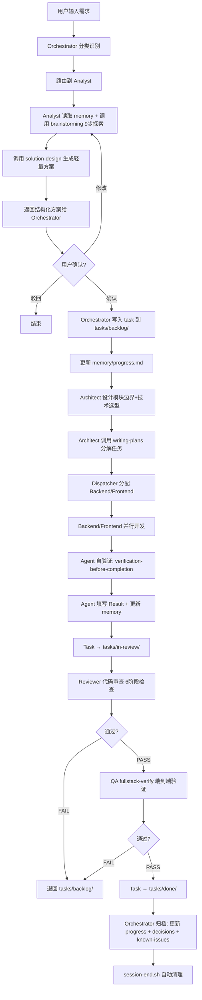
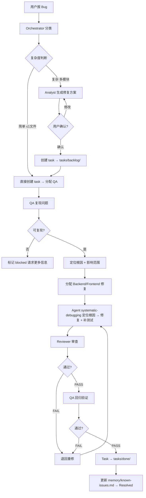
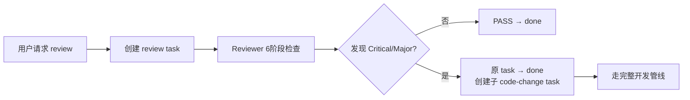
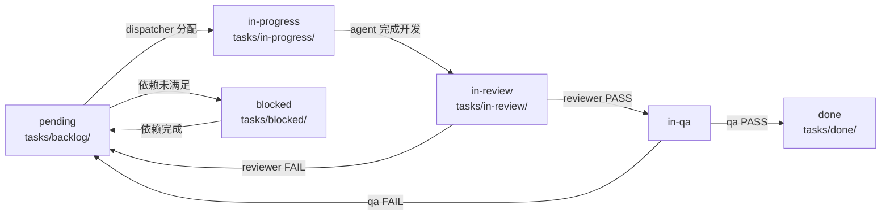

# Claude Code 多 Agent 开发框架 — 使用手册

你只需要在聊天窗口输入需求，所有需求分析、方案设计、任务分配、代码审查、质量验证由 7 个专业 Agent 自动协作完成。

---

## 一、你能做什么

| 类型 | 示例 |
|------|------|
| 新功能 | "帮我做一个用户登录功能，支持邮箱+密码和 Google OAuth" |
| 修 Bug | "修复支付回调失败的问题" |
| 重构 | "重构 user service，把超长函数拆开" |
| 架构设计 | "设计一个消息通知系统的架构" |
| 代码审查 | "review 一下 backend/auth 模块" |
| 测试验证 | "验证一下刚才的登录功能" |

---

## 二、发生了什么（流程图）

### Feature 开发流程（完整管线）



### Bug 修复流程



### 独立代码审查流程



### 任务状态流转



---

## 三、你会看到什么

### 1. 收到需求后 — Analyst 生成方案

```markdown
## 需求分析

### 用户目标
实现用户登录功能，支持邮箱+密码登录，返回 JWT token。

### 需求拆解
1. 后端登录 API（验证凭据、返回 token）
2. JWT 中间件（保护需要认证的接口）
3. 前端登录页面（表单、错误提示、token 存储）

---

## 技术方案

### 模块设计
| 模块 | 变更类型 | 说明 |
|------|---------|------|
| backend/api/auth | 新增 | 登录接口 |
| backend/middleware | 新增 | JWT 验证中间件 |
| frontend/pages/login | 新增 | 登录页面 |

### API 草案
| Method | Path | 说明 |
|--------|------|------|
| POST | /api/v1/auth/login | 邮箱+密码登录，返回 JWT |

### 数据模型
```
User
├── id: uuid
├── email: string
├── password_hash: string
└── created_at: timestamp
```

---

## 任务拆分

| # | 任务 | Agent | 优先级 | 依赖 |
|---|------|-------|--------|------|
| 1 | 设计 User 实体 + 登录 API | backend | high | 无 |
| 2 | 实现 JWT 中间件 | backend | high | 1 |
| 3 | 前端登录页面 | frontend | medium | 1 |

### 依赖图
Task-1 → Task-2
       → Task-3

---

## 风险与影响
| 风险 | 概率 | 影响范围 |
|------|------|---------|
| JWT 密钥泄露 | 低 | 全部认证接口 |

## 验收条件
- [ ] 正确邮箱+密码 → 返回 JWT token
- [ ] 错误密码 → 返回 401
- [ ] 未登录访问受保护接口 → 返回 401
- [ ] 前端登录成功 → 存储 token 并跳转

---
确认以上方案，或提出修改意见。
```

### 2. 开发过程中 — 静默执行

Agent 自动完成开发、自测（verification-before-completion 验证门禁）、回写文档，你不需要操作任何文件。

### 3. 完成后 — 汇总结果

```
Task-20260529-001: 登录 API — PASS
  - 修改: backend/api/auth/login.ts, backend/models/user.ts
  - Review: PASS（6 阶段检查无问题）
  - QA: PASS（覆盖正常/异常/边界，fullstack-verify 通过）
```

---

## 四、框架自动维护的文档

```
.claude/
├── CLAUDE.md                  ← 项目宪法（核心原则 + 架构约束 + 质量规则）
├── FRAMEWORK.md               ← 完整框架文档（流程/Agent/Superpowers/留痕）
├── settings.json              ← 权限配置 + hooks
│
├── agents/                    ← Agent 定义（7 个）
│   ├── orchestrator.md           ← 总调度：分类、路由、归档、会话汇总
│   ├── analyst.md                ← 需求分析：方案设计（只读调研，不写代码）
│   ├── architecture.md           ← 架构设计：模块边界、技术选型、架构图
│   ├── backend.md                ← 后端开发：API、Service、Repository
│   ├── frontend.md               ← 前端开发：页面、组件、状态管理
│   ├── reviewer.md               ← 代码审查：6阶段静态分析
│   └── qa.md                     ← 质量验证：fullstack-verify 动态验证
│
├── routing/                   ← 路由规则
│   ├── intent-router.md          ← 需求 → Agent 分类映射
│   ├── context-loader.md         ← 每个 Agent 启动时加载的上下文清单
│   └── task-dispatcher.md        ← 任务状态机 + 分发规则 + 并发控制
│
├── superpowers/               ← 能力体系（三层架构）
│   ├── registry.md               ← 全局能力目录（50+ 条目 + Agent 分配矩阵）
│   ├── cards/{agent}.md          ← 每个 Agent 的能力卡（核心/可选/禁止）
│   └── bindings/                 ← MCP/插件 → Agent 映射文档
│       ├── _TEMPLATE.md          ← 新增 MCP/插件接入模板
│       ├── mcp-pencil.md         ← Pencil MCP（12 工具）
│       ├── plugin-frontend-design.md
│       ├── plugin-karpathy-guidelines.md
│       └── plugin-superpowers.md ← Superpowers 社区插件（14 skills）
│
├── skills/                    ← Agent 可调用技能
│   ├── design/
│   │   └── solution-design.md    ← 方案设计模板（analyst，轻量补充）
│   ├── coding/
│   │   ├── api-design.md         ← API 设计方法论（backend/analyst/qa）
│   │   ├── code-review.md        ← 审查方法论：6 阶段检查清单（reviewer）
│   │   ├── debugging.md          ← 轻量调试流程（轻量替代）
│   │   ├── refactor.md           ← 安全重构流程（analyst）
│   │   └── testing.md            ← 分层测试设计（backend/frontend/qa）
│   └── standards/                ← 编码规范（所有 agent 始终遵守）
│       ├── api-standard.md       ← RESTful API 规范
│       ├── coding-standard.md    ← 编码规范（命名/类型/结构）
│       └── security-standard.md  ← 安全规范（注入防护/认证/数据保护）
│
├── workflows/                 ← 工作流定义
│   ├── feature-development.md
│   ├── bug-fix.md
│   └── code-review.md
│
├── memory/                    ← 项目记忆（唯一事实来源）
│   ├── project-context.md        ← 项目背景 + 核心模块
│   ├── architecture.md           ← 系统架构 + 模块边界 + 数据流
│   ├── tech-stack.md             ← 技术栈选型
│   ├── decisions.md              ← 架构决策记录 (ADR)
│   ├── design-system.md          ← 前端设计系统（token + 组件清单）
│   ├── known-issues.md           ← 已知问题追踪
│   └── progress.md               ← 项目进度快照（Done/In Progress/Review/Blocked/Next）
│
├── tasks/                     ← 任务看板
│   ├── backlog/_TEMPLATE.md      ← 任务模板
│   ├── in-progress/
│   ├── in-review/
│   ├── blocked/
│   └── done/
│
└── hooks/                     ← 生命周期钩子
    └── session-end.sh            ← 会话结束自动清理
```

---

## 五、常用交互

| 场景 | 输入示例 |
|------|---------|
| 开始新功能 | "帮我做一个 XX 功能" |
| 修改方案 | "方案中第2个任务拆成两个" 或 "不需要前端部分" |
| 驳回方案 | "这个方案不行" |
| 查看进度 | "当前项目进度" |
| 查看已知问题 | "有哪些已知问题" |
| 查看架构决策 | "看看架构决策记录" |
| 查看架构设计 | "当前系统架构是怎样的" |
| 报 Bug | "XX 页面点击提交没反应" |
| 请求审查 | "review 一下最近的改动" |
| 验证功能 | "验证一下刚才的登录功能" |
| 查看 Agent 能力 | "Backend Agent 能做什么" |

---

## 六、7 个 Agent 详解

### Orchestrator（总调度）

| 属性 | 内容 |
|------|------|
| **一句话职责** | 项目总调度中心 |
| **触发场景** | 每次用户交互 |
| **核心能力** | using-superpowers, verification-before-completion, finishing-dev-branch, agent-spawn, task-manage, file-ops-read/write, git-ops |
| **可选能力** | brainstorming, writing-plans, writing-skills, subagent-driven-dev, executing-plans, dispatching-parallel, requesting-code-review, using-git-worktrees, code-search |
| **禁止项** | 不写业务代码、不出详细方案、不操作设计文件、不使用 MCP 工具 |

### Analyst（需求分析）

| 属性 | 内容 |
|------|------|
| **一句话职责** | 将模糊需求转化为结构化可执行方案 |
| **触发场景** | feature / complex-bug / refactor / architecture |
| **核心能力** | using-superpowers, brainstorming（9步探索，主流程）, verification-before-completion, web-search, web-fetch, solution-design（轻量补充）, api-design, code-search |
| **可选能力** | refactor, coding-standard, api-standard, security-standard |
| **禁止项** | 不写代码、不操作文件（只读调研）、不触发执行 agent |

### Architect（架构师）

| 属性 | 内容 |
|------|------|
| **一句话职责** | 模块边界划分、技术选型、架构图绘制 |
| **触发场景** | 新模块设计、技术选型、架构变更 |
| **核心能力** | using-superpowers, brainstorming, writing-plans, verification-before-completion, Pencil MCP（canvas/read/layout/export）, file-ops-write（写 memory）, coding-standard |
| **可选能力** | Pencil（screenshot/space/state）, web-search, web-fetch, writing-skills, receiving-code-review |
| **禁止项** | 不写业务代码、不参与任务分发 |

### Backend（后端开发）

| 属性 | 内容 |
|------|------|
| **一句话职责** | API 实现、数据库操作、Service 层业务逻辑 |
| **触发场景** | 所有后端开发任务 |
| **核心能力** | using-superpowers, systematic-debugging（优先）, verification-before-completion, shell-test, git-ops, file-ops-read/write, karpathy-guidelines, api-standard, coding-standard, security-standard |
| **可选能力** | tdd, executing-plans, requesting-code-review, receiving-code-review, api-design, testing, debugging（轻量替代）, web-fetch |
| **禁止项** | 不修改 frontend、不操作设计文件（Pencil）、不绕过 orchestrator |

### Frontend（前端开发）

| 属性 | 内容 |
|------|------|
| **一句话职责** | 页面实现、组件开发、状态管理、API 对接 |
| **触发场景** | 所有前端开发任务 |
| **核心能力** | using-superpowers, systematic-debugging（优先）, verification-before-completion, frontend-design plugin, 全部 Pencil 工具（read/export/variables/guidelines/screenshot）, design-to-code（组合能力）, shell-test, git-ops, karpathy-guidelines |
| **可选能力** | tdd, executing-plans, requesting-code-review, receiving-code-review, Pencil canvas/layout/space/properties/replace, web-fetch, testing, debugging（轻量替代） |
| **禁止项** | 不修改 backend、不操作设计文件中的架构图层 |

### Reviewer（代码审查）

| 属性 | 内容 |
|------|------|
| **一句话职责** | 代码质量守门人——静态分析 |
| **触发场景** | 所有 code-change 任务开发完成后；独立审查任务 |
| **核心能力** | using-superpowers, verification-before-completion, requesting-code-review, code-review（6阶段检查清单）, code-search, git-ops, file-ops-read, api/coding/security standards |
| **可选能力** | karpathy-guidelines, shell-test |
| **允许写入** | 仅限 task 文件 `## Review` 区 + memory（known-issues, progress）追加 |
| **禁止项** | 不修改业务代码、不操作设计文件、不参与任务分发 |

### QA（质量验证）

| 属性 | 内容 |
|------|------|
| **一句话职责** | 质量验证工程师——行为级动态验证 |
| **触发场景** | reviewer PASS 后的 in-qa 阶段；bug-fix 的复现和回归验证 |
| **核心能力** | using-superpowers, systematic-debugging（优先）, verification-before-completion, fullstack-verify（组合能力）, shell-test, web-fetch, code-search, git-ops, api/coding/security standards |
| **可选能力** | tdd, dispatching-parallel, api-design, testing, debugging（轻量替代）, web-search |
| **允许写入** | 仅限 task 文件 `## QA Result` 区 + memory（known-issues, progress）追加 |
| **禁止项** | 不修改业务代码、不操作设计文件、不绕过 reviewer 流程 |

### Reviewer 与 QA 的边界

| 维度 | Reviewer 查（代码级静态） | QA 查（行为级动态） |
|------|--------------------------|---------------------|
| 安全性 | 代码中有无 SQL 拼接、硬编码密钥 | 实际请求中鉴权是否生效 |
| 性能 | 代码中有无 N+1 模式、缺少分页 | 实际运行中的慢查询、内存泄漏 |
| 规范 | 命名、类型、错误处理是否符合标准 | 实际 API 响应格式是否与规范一致 |
| 功能 | 不检查 | 功能是否符合需求、边界条件 |

> 冲突裁决：**QA 的行为验证结果优先**（行为优先于代码模式）。

---

## 七、Superpowers 能力体系

每个 Agent 的能力通过三层结构管理：

| 层 | 文件 | 作用 |
|----|------|------|
| **Registry** | `superpowers/registry.md` | 全局能力目录（50+ 条目 + Agent 分配矩阵） |
| **Cards** | `superpowers/cards/{agent}.md` | 每个 Agent 的能力配置（核心/可选/禁止） |
| **Bindings** | `superpowers/bindings/{name}.md` | MCP/插件工具列表、使用指南、Agent 分配 |

### 能力类型

| 类型 | 说明 | 示例 |
|------|------|------|
| `mcp_tool` | MCP 服务器提供的工具 | Pencil（12 设计工具） |
| `plugin_skill` | 社区插件提供的 Skill | brainstorming, tdd, systematic-debugging 等 16 个 |
| `builtin_tool` | Claude Code 内置工具 | WebSearch, Bash, Grep, Agent |
| `local_skill` | 项目本地 Skill | solution-design, code-review, testing 等 9 个 |
| `composite` | 组合能力 | design-to-code, fullstack-verify |

### Superpowers 社区插件集成（14 skills）

| Skill | 类型 | orch | analyst | architect | backend | frontend | reviewer | qa |
|-------|------|------|---------|-----------|---------|----------|----------|-----|
| using-superpowers | 元技能 | R | R | R | R | R | R | R |
| verification-before-completion | 质量 | R | R | R | R | R | R | R |
| brainstorming | 规划 | O | R | R | - | - | - | - |
| writing-plans | 规划 | O | - | R | - | - | - | - |
| systematic-debugging | 质量 | - | - | - | R | R | - | R |
| tdd | 质量 | - | - | - | O | O | - | O |
| requesting-code-review | 审查 | O | - | - | O | O | R | - |
| receiving-code-review | 审查 | - | - | O | O | O | - | - |
| finishing-dev-branch | 基础设施 | R | - | - | - | - | - | - |
| subagent-driven-dev | 执行 | O | - | - | - | - | - | - |
| executing-plans | 执行 | O | - | - | O | O | - | - |
| dispatching-parallel | 执行 | O | - | - | - | - | - | O |
| using-git-worktrees | 基础设施 | O | - | - | - | - | - | - |
| writing-skills | 元技能 | O | - | O | - | - | - | - |

> R = Required（必需）, O = Optional（可选）, - = 不适用

**与项目本地 Skills 的关系**：
- `brainstorming` + `writing-plans` 为主流程，项目 `solution-design` 为轻量补充
- `systematic-debugging`（4阶段）优先于项目 `debugging`（轻量快速排查保留）
- `tdd` 定义 RED-GREEN-REFACTOR 铁律，项目 `testing` 定义测试分层和覆盖率标准
- `requesting-code-review` 定义"如何发起审查"，项目 `code-review` 定义"审查什么"（6阶段检查清单）

### 插件安装（推荐）

```bash
/plugin install anthropic-official/frontend-design
/plugin install anthropic-official/karpathy-guidelines
/plugin install claude-plugins-official/superpowers
```

---

## 八、核心规则

1. **方案先确认再写入** — 用户确认前，analyst 不写任何文件
2. **所有任务走 orchestrator** — agent 之间不直接通信，禁止绕过 routing
3. **memory 是唯一事实来源** — 所有 agent 从 memory 读、往 memory 写
4. **每个 agent 首读 superpower card** — 了解可用能力和禁止边界
5. **禁止跨模块随意修改** — backend 不改 frontend，frontend 不改 backend
6. **每个代码变更必须经过 reviewer** — no review, no merge
7. **完成前必须自验证** — verification-before-completion 门禁，禁止未验证就声称完成
8. **状态流转不可跳步** — pending → in-progress → in-review → in-qa → done

---

## 九、任务文件生命周期

每个 task 文件包含完整的执行链路：

```markdown
# TASK-{YYYYMMDD}-{序号}: {标题}

## Meta
type / owner / priority / status / depends_on / parallel / created

## Scope        ← 要做什么
## Target Files ← 涉及的文件
## Acceptance   ← 验收条件（可测试 checklist）

## Result       ← 执行 Agent 填写（outcome / summary / changed_files）
## Review       ← Reviewer 填写（PASS/FAIL + 问题清单 + 严重级别）
## QA Result    ← QA 填写（PASS/FAIL + 问题清单 + 风险分析）
```

**追踪方式**：
- 完整执行链：`Meta.owner` → `## Result` → `## Review` → `## QA Result`
- 修改范围：`## Result.changed_files`
- 驳回原因：`## Review` 或 `## QA Result` 中的 FAIL 问题清单

---

## 十、设计记录速查

| 我想了解... | 查看... |
|------------|--------|
| 项目当前进度 | `memory/progress.md` |
| 系统架构设计 | `memory/architecture.md` |
| 为什么选某个技术 | `memory/decisions.md`（ADR 格式） |
| 技术栈详情 | `memory/tech-stack.md` |
| 前端设计系统 | `memory/design-system.md` |
| 有哪些已知 Bug | `memory/known-issues.md` |
| 某个任务谁做的、改了什么 | `tasks/done/TASK-*.md` 的 `## Result` 区 |
| 审查发现了什么问题 | 对应 task 文件的 `## Review` 区 |
| QA 验证了什么 | 对应 task 文件的 `## QA Result` 区 |
| 任务为什么被阻塞 | `tasks/blocked/` 中 task 的 `depends_on` |
| Backend Agent 能做什么 | `superpowers/cards/backend.md` |
| Frontend 怎么用 Pencil | `superpowers/bindings/mcp-pencil.md` |
| 所有 Agent 的能力分配 | `superpowers/registry.md` |
| 如何新增 MCP/插件 | `superpowers/bindings/_TEMPLATE.md` → registry → cards → context-loader |

---

## 十一、常见问题

### Q: 小项目需要完整的 7 Agent 流程吗？

不需要。框架支持按复杂度调整：
- **简单改动**（改配置、修 typo）→ 直接改，不走管线
- **单文件 bug** → QA 复现 → 修复 → 审查 → 回归（跳过 Analyst）
- **新功能 / 复杂修复 / 重构** → 完整 7 Agent 管线

### Q: Memory 文件需要手动维护吗？

大部分由 Agent 自动更新。首次使用时需初始化 `project-context.md`、`architecture.md`、`tech-stack.md`。之后的 `progress.md`、`decisions.md`、`known-issues.md` 由 Orchestrator 在会话中自动维护。

### Q: Reviewer 和 QA 有什么区别？

Reviewer 检查**代码写成什么样**（SQL 注入、N+1、命名规范），QA 检查**系统跑起来对不对**（API 返回正确吗、前端渲染正常吗、回归了吗）。两者互补，冲突时 QA 的行为验证结果优先。

### Q: 如何添加新的 MCP 工具或插件？

1. 在 `superpowers/bindings/` 创建映射文档（参考 `_TEMPLATE.md`）
2. 在 `superpowers/registry.md` 注册新工具 + 更新 Agent 分配矩阵
3. 更新相关 Agent 的 card
4. 更新 `routing/context-loader.md`

### Q: 必须在 Claude Code 中使用吗？

框架设计目标是 Claude Code（利用了 Agent 工具做子代理分发），但核心思路（方案先行、职责分离、Memory 做事实来源）适用于任何 AI 编码助手。
