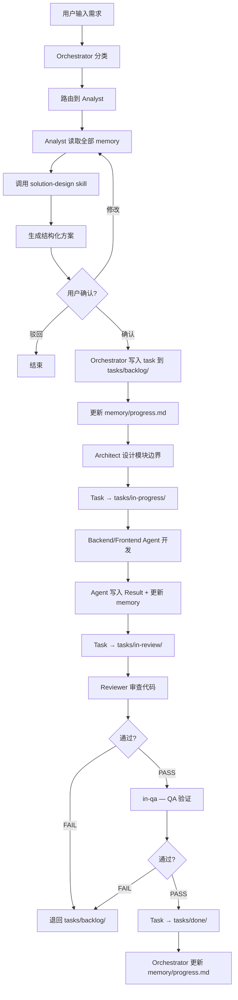
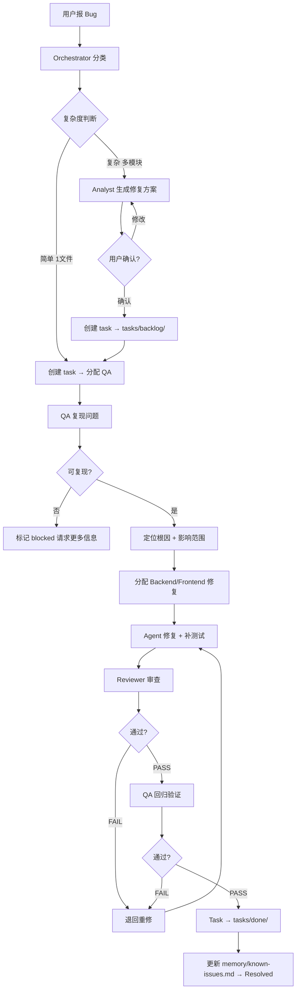
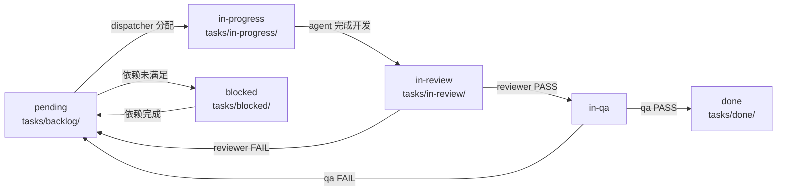

# Claude Code 多 Agent 开发框架 — 使用手册

你只需要在聊天窗口输入需求，所有文档归档、任务分配、质量检查由 Agent 自动完成。

---

## 一、你能做什么

| 类型 | 示例 |
|------|------|
| 新功能 | "帮我做一个用户登录功能" |
| 修 Bug | "修复支付回调失败的问题" |
| 重构 | "重构 user service，把超长函数拆开" |
| 架构设计 | "设计一个消息通知系统的架构" |
| 代码审查 | "review 一下 backend/auth 模块" |
| 测试验证 | "验证一下刚才的登录功能" |

---

## 二、发生了什么（流程图）

### Feature 开发流程



### Bug 修复流程



### 任务状态流转（完整）



---

## 三、你会看到什么

### 1. 收到需求后 — Analyst 生成方案

```markdown
## 需求分析

### 用户目标
实现用户登录功能，支持邮箱+密码登录，返回 JWT token。

### 需求拆解
1. 后端登录 API（验证凭据、返回 token）
2. JWT 中间件（保护需要认证的接口）
3. 前端登录页面（表单、错误提示、token 存储）

---

## 技术方案

### 模块设计
| 模块 | 变更类型 | 说明 |
|------|---------|------|
| backend/api/auth | 新增 | 登录接口 |
| backend/middleware | 新增 | JWT 验证中间件 |
| frontend/pages/login | 新增 | 登录页面 |

### API 草案
| Method | Path | 说明 |
|--------|------|------|
| POST | /api/v1/auth/login | 邮箱+密码登录，返回 JWT |

### 数据模型
```
User
├── id: uuid
├── email: string
├── password_hash: string
└── created_at: timestamp
```

---

## 任务拆分

| # | 任务 | Agent | 优先级 | 依赖 |
|---|------|-------|--------|------|
| 1 | 设计 User 实体 + 登录 API | backend | high | 无 |
| 2 | 实现 JWT 中间件 | backend | high | 1 |
| 3 | 前端登录页面 | frontend | medium | 1 |

### 依赖图
Task-1 → Task-2
       → Task-3

---

## 风险与影响
| 风险 | 概率 | 影响范围 |
|------|------|---------|
| JWT 密钥泄露 | 低 | 全部认证接口 |

## 验收条件
- [ ] 正确邮箱+密码 → 返回 JWT token
- [ ] 错误密码 → 返回 401
- [ ] 未登录访问受保护接口 → 返回 401
- [ ] 前端登录成功 → 存储 token 并跳转

---
确认以上方案，或提出修改意见。
```

### 2. 开发过程中 — 静默执行

Agent 自动完成开发、自测、回写文档，你不需要操作任何文件。

### 3. 完成后 — 汇总结果

```
Task-20260525-001: 登录 API — PASS
  - 修改: backend/api/auth/login.ts, backend/models/user.ts
  - Review: PASS
  - QA: PASS（覆盖正常/异常/边界）
```

---

## 四、Agent 自动维护的文档

```
.claude/
├── agents/             ← Agent 定义（7 个）
│   ├── orchestrator.md     ← 总调度
│   ├── analyst.md          ← 需求分析
│   ├── architecture.md     ← 架构设计
│   ├── backend.md          ← 后端开发
│   ├── frontend.md         ← 前端开发
│   ├── reviewer.md         ← 代码审查
│   └── qa.md               ← 质量保障
├── memory/              ← 项目记忆（唯一事实来源）
│   ├── project-context.md  ← 项目信息
│   ├── architecture.md     ← 系统架构
│   ├── tech-stack.md       ← 技术栈
│   ├── decisions.md        ← 架构决策记录 (ADR)
│   ├── design-system.md    ← 设计系统
│   ├── known-issues.md     ← 已知问题
│   └── progress.md         ← 当前进度
├── routing/             ← 路由规则
│   ├── intent-router.md    ← 意图 → Agent 映射
│   ├── context-loader.md   ← 上下文加载规则
│   └── task-dispatcher.md  ← 任务分发/状态机
├── skills/              ← Agent 可调用技能
│   ├── design/solution-design.md  ← 方案设计（analyst）
│   ├── coding/api-design.md       ← API 设计（backend/qa）
│   ├── coding/code-review.md      ← 代码审查方法论（reviewer）
│   ├── coding/debugging.md        ← 调试（backend/frontend/qa）
│   ├── coding/refactor.md         ← 重构（analyst）
│   ├── coding/testing.md          ← 测试（backend/frontend/qa）
│   └── standards/                 ← 编码/API/安全规范（所有 agent 遵守）
├── tasks/               ← 任务文件
│   ├── backlog/         ← 待开始
│   ├── in-progress/     ← 进行中
│   ├── in-review/       ← 审查中 / QA 中
│   ├── blocked/         ← 被阻塞
│   └── done/            ← 已完成
├── workflows/           ← 工作流定义
│   ├── feature-development.md
│   ├── bug-fix.md
│   └── code-review.md
├── CLAUDE.md            ← 框架入口规则
└── settings.json        ← 权限/hooks/模型配置
```

---

## 五、常用交互

| 场景 | 输入示例 |
|------|---------|
| 开始新功能 | "帮我做一个 XX 功能" |
| 修改方案 | "方案中第2个任务拆成两个" 或 "不需要前端部分" |
| 驳回方案 | "这个方案不行" |
| 查看进度 | "当前项目进度" |
| 查看已知问题 | "有哪些已知问题" |
| 查看架构决策 | "看看架构决策记录" |
| 报 Bug | "XX 页面点击提交没反应" |
| 请求审查 | "review 一下最近的改动" |

---

## 六、Agent 清单与技能

| Agent | 做什么 | 触发场景 | 可调用 Skill |
|-------|--------|---------|-------------|
| **Orchestrator** | 分类、路由、归档、会话汇总 | 每次交互 | — |
| **Analyst** | 需求分析、生成方案 | 新功能/复杂修复/重构 | solution-design, api-design, refactor |
| **Architect** | 模块边界、技术选型 | 涉及架构变更时 | — |
| **Backend** | API、数据库、业务逻辑 | 后端任务 | api-design, testing, debugging |
| **Frontend** | 页面、组件、状态管理 | 前端任务 | testing, debugging |
| **Reviewer** | 代码审查（6维度） | 所有代码变更后 | code-review |
| **QA** | 复现、验证、回归 | Bug 复现、功能验证 | debugging, testing, api-design |

> **规则 vs 技能**: standards/ 下的是**规则**（所有 agent 始终遵守），coding/design/ 下的是**技能**（agent 按需调用）。

---

## 七、核心规则

1. **方案先确认再写入** — 用户确认前，analyst 不写任何文件
2. **所有任务走 orchestrator** — agent 之间不直接通信
3. **memory 是唯一事实来源** — 所有 agent 从 memory 读、往 memory 写
4. **每个代码变更必须经过 reviewer** — no review, no merge
5. **状态流转不可跳步** — pending → in-progress → in-review → in-qa → done
